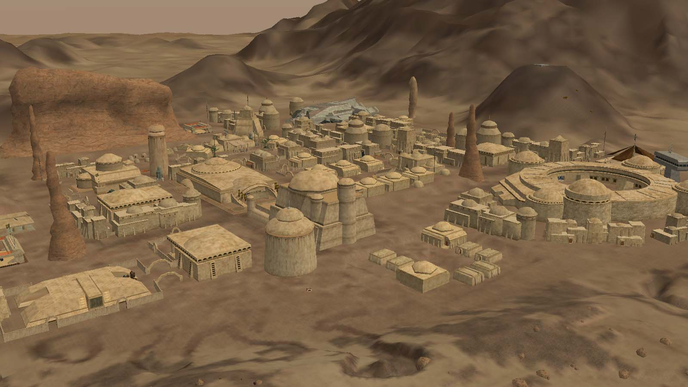
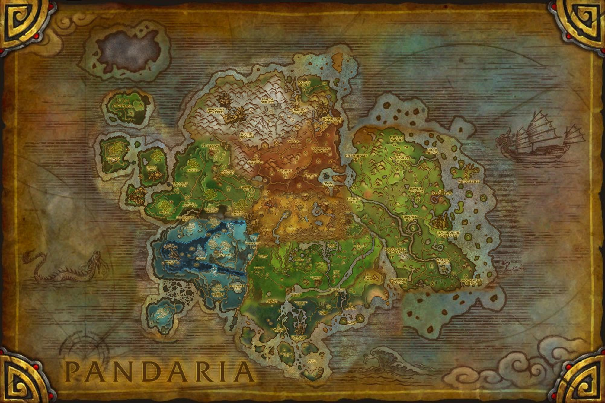

## Intro
I think we were all promised online worlds and we were given online games.

I really like games (believe me) but I've had a lingering feeling for nearly two decades now that we're all missing out on something really incredible. Something that we've gotten a few messy but fascinating glimpses of over the years.

There is a lot of agreement online that the MMOs of today are missing something. I very much agree. Some corners of the internet have made "themeparking" (games that rely on a defined progression of developer-crafted content) the villain...this is part of it certainly but not all of it. 

What is missing from modern online games is the sensation of **being in a world**.

## Structure

This article is primarily structured around a few concepts that I think make a digital world feel like a world. I've also included a great modern, or near-modern, game that uses that concept extremely well and some counterexamples of that idea done poorly.

**[Evergreen Zones - Runescape](#evergreen-zones---runescape)**
 
**[Player-Driven Hubs - Star Wars Galaxies](#player-driven-hubs---star-wars-galaxies)** 

**[Meaningful Map - Archeage](#meaningful-map---archeage)**

**[Seamless World - World of Warcraft](#seamless-world---world-of-warcraft)**

Finally a brief discussion of an incredibly popular genre that *is* doing a lot of things right to make compelling, if smaller-scale, digital worlds.

**[An Unlikely Successor - Survival Crafting](#an-unlikely-successor---survival-crafting)**

## Concepts
### Evergreen Zones - Runescape

I think this might be the most important screenshot in modern MMOs. It looks extremely boring but there's something happening here that doesn't really exist in games other games. On this single screen are:
- Some Lvl 13 rats to fight
- Some adamantine ore to mine at lvl 40 mining
- A single elder tree to cut at lvl 90 woodcutting
- Multiple oak tress to cut at lvl 10 woodcutting
- Pickable berries that you can then farm at lvl 20 farming

Runescape is probably the shining example of "feels like a world" in MMOs today. Its killer feature is what I call **Evergreen Zones**. No area of the world is ever truly outgrown, or discarded, or used up. The screenshot shows the area just outside one of the first major cities in the game, Varrock. You're likely to end up here for the *first* time after 20-60 minutes of game time. You're likely to end up here for the *last* time....never. This area never stops being relevant to your character's journey.

Runescape's Varrock will see more and less use throughout a player's journey but the player will not be finished with it until they are finished with Runescape.

### Counterexample
Essentially any modern MMO is a good counterexample. Runescape is almost entirely unique in this way. 

Some of the standard themepark MMOs are attempting to keep content relevant by changing a character's level to match the zone level no matter where they are in their progression. This is not Evergreen Zones. Simply changing a character's level to match a zone still allows a player to use and discard a zone once they've exhausted its content. 

Evergreen Zones are just that, evergreen. Their content is not exhausted until the *entire game's* content is exhausted. 

## Player-Driven Hubs - Star Wars Galaxies

The wilderness of Star Wars Galaxies is a largely same-y proc-gen landscape. It was revolutionary for the time and was apparently designed so that the truly massive planets it contained fit on the already impressive 5 disc install media.

The towns and cities are not proc gen (though some were player created!). And boy, those towns are *fucking stunning*. Not....visually, the game looks like absolute ass by today's standards. But from a design perspective SWG's cities are near perfect virtual world structures and the source of the next feature: **Player-Driven Hubs** or the variety of purposes served by each town.

Each town had spaceports, cantinas, hospitals, and markets that players would move between and accomplish their tasks. Crucially each location was one where players would interact with one another. Cantinas were staffed by players who chose to be entertainers, hospitals by players who chose to be doctors, and markets were full of player-built items.

To visit a town in Star Wars Galaxies was to immediately see 30 different players with 30 different goals and 30 different professions going 30 different places. Nothing since has felt quite so much like a real city center.

### Counterexample
A game like World of Warcraft also has busy player hubs but the difference between World of Warcraft's cities and Star Wars Galaxies' is that the cities in World of Warcraft *serve* players but do not *need* them. The cities in Star Wars Galaxies are a scaffold upon which player agency drives the entire game.

---
## Meaningful Maps - Archeage

This is the Archeage transit route map. If you don't think this is just really cool then I don't even want to know you. (Yes I do, I want to know you so I can convince you how cool public transit in video games is.)

On a surface level Archeage is similar to a lot of "themepark" MMos with a linear levelling experience that takes the player through a series of escalating zones. But Archeage isn't about leveling. 

Archeage's endgame was trade. It was about producing and carrying silly little packages around the world, by foot and by boat and by...donkey, and trying not to die (to monsters or players) while doing it. 

Players grew or gathered resources and took them to a specific location where they were turned into a trade pack. Once the trade pack was produced the player was *very* slow and could not fast travel. Their objective is to take a trade pack to a drop-off in a different zone. The further you go, and the more dangerous the journey (especially if you carry it through PvP pirate-infested oceans), the more the pack is worth when dropped off. 

This system is just rad as hell and could be an article of its own. But for our purposes here it results in Archeage's best feature: a **Meaningful Map**.

Where you spend your time, or place your in-game home, has enormous impact. Each forces the player to engage with Archeage's map in more ways than "what zone is appropriate for my level". For example:

- Access to rivers and oceans is vital for transporting trade packs via boat
- Access to the public transit network of carriages and airships (see header image) varies by zone allowing faster travel, even while carrying a pack
- Zones have climates that influence what can be farmed in them at player farms
- The workbenches that produce tradepacks are in different locations and require different resources in each zone
- Zones belong to factions and have different levels of conflict facilitating a risk/reward tradeoff

Archeage's combination of game and map design compels the player to consider positioning, geography, and logistics and makes the shape of the world relevant in a way that is truly rare.

### Counterexample
This feature is almost a one-to-one mapping of the "themepark" vs "sandbox" divide. The only modern MMOs that are *not* a counterexample are the sandbox games like Star Wars Galaxies, Albion Online, and Eve Online.

## Seamless World - World of Warcraft

That's right, I've included the world's largest themepark MMO in my list of things missing from themepark MMOs! But, World of Warcraft does one thing better than any other online game: its **Seamless World**. 

World of Warcraft avoids portals between zones and obvious zone "transitional spaces" such as small tunnels and doorways. Instead the entire world is connected in logical ways and zone transitions happen across rivers or mountains. The zones are not square but form largely logical shapes and the player only rarely encounters loading screens (usually between continents). 

There's a bunch of cool knock-on effects here too:
- Rivers continue across zones and the player character can even "follow them up/downstream"
- Mountains spotted in the distance can (usually) be reached
- Players can fly in the air and get birds-eye view of a zone, pick a place to go, and go there with no barriers
- (My personal favorite) The in-game map is both beautiful and "honest", it respects the real barriers of the game's zones

This is a phenomenal way to make the game feel like a real place! Almost nothing has the potential to feel "game-y" like a loading screen or invisible wall. World of Warcraft has many flaws but the "World" is not one of them.

### Counterexample
Guild Wars 2 is a wonderful game...but its zones are poorly laid out. Each is a perfect rectangle that connects to other perfect rectangles via portals in small gaps between them. Nowhere in GW2 are zones separated by a river, or a ravine, or a forest. Its always mountains with small gaps for portals.

The difference in feel between the Guild Wars 2 and World of Warcraft maps is striking. World of Warcraft feels like the map of real continent while Guild Wars 2 feels like a game's map.

## An Unlikely Successor - Survival Crafting
Which brings us to survival crafting games. Survival crafting carries the ethos of these older MMOs forward in modern gaming. Here's how each manifests:

- **Evergreen Zones**: A mixed bag. Some survival games will have you progress quickly beyond starter zones. Some do a better job of asking the player to return and recontextualize early zones. 
- **Player-Driven Hubs**: The limited scope of survival crafting games harms here with most servers being 4-8 players. But the players' "home base" often does a very serviceable job of simulating this. You may return from a cave dive in Minecraft to one friend building their room and another baking a cake. The wonder of hundreds of players in motion is missing but the effect is not entirely lost.
- **Meaningful Map**: Almost all survival crafting games provide the ability to build "bases" and require the player to maintain resources. This means the map, and positioning within it, has enormous value to the player. This is a huge draw of nearly every modern survival crafting games.
- **Seamless World**: A staple of the genre. Almost all survival crafting games feature large, seamless, open worlds.

The survival crafting genre is the most obvious real attempt at online worlds in the gaming space. But they're insufficient. We could be doing more!

## Outro
I concede that its possible the world has simply moved on from being able to create digital worlds in a way that allows for experimentation. Games tend to either be complete failures or...Fortnite...these days and I think the world (real and online) is so much smaller for it. 

Maybe my nostalgia is just that. The past. All of these features are certainly less financially secure bets than rolling the dice on whatever genre is top of the steam charts (or at least I assume that's the case because that's where the money keeps....going...). 

But I think there's a gap here that players are seeing, and feeling, and I think that gap is growing. There are a lot of signs of unmet demand in the space:

- "Sandbox" MMOs tend to be the least flash in the pan MMOs, which I believe points to a playerbase with few options.
- Posts and articles (like this one) pop up daily pining for Archeage or Star Wars Galaxies. 
- New World was designed as a survival MMO before pivoting away. 
- Dune: Awakening (a game who's reach truly exceeded its grasp) has the population of a major city playing it all day every day.
- Runescape is having a huge resurgence *right now* on top of retaining a steady, and even growing, playerbase for the last dozen years. 
- World of Warcraft is adding player housing next year. 

I think the pieces needed to meet this need exist. I hope I've identified a few of them here (and I'd love to hear your thoughts on others). And while I have no idea what the future holds but I'm extremely optimistic that we haven't left digital worlds behind. We can certainly build them. We have the technology. 

I hope we can all find the will.

...and the money.